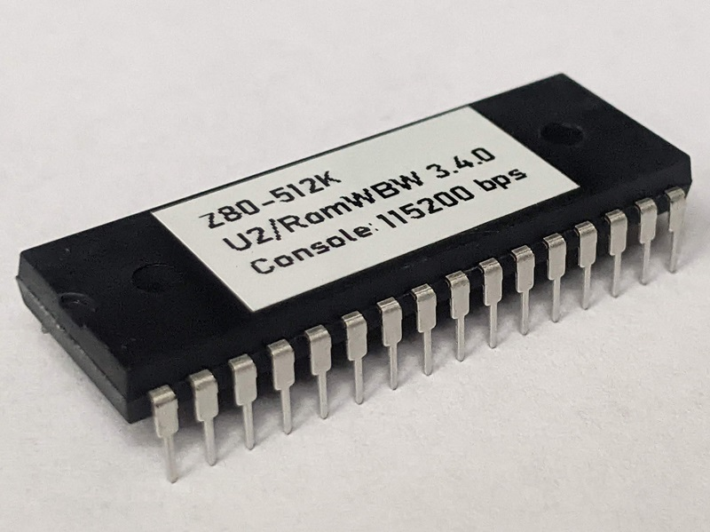
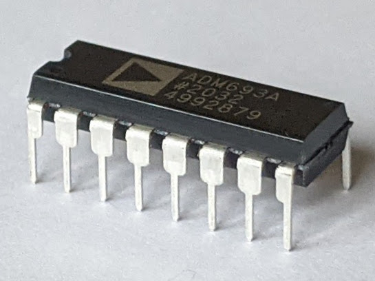
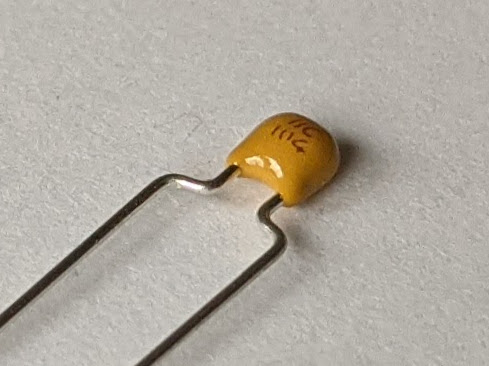
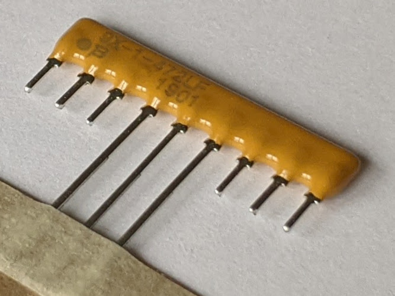
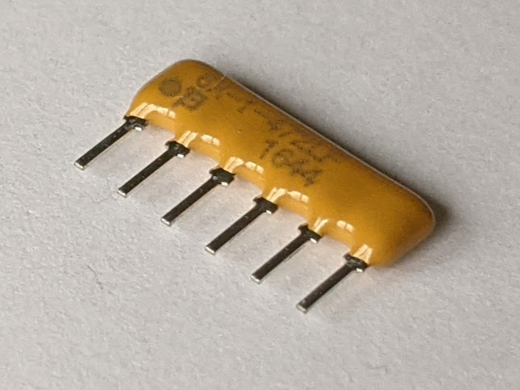
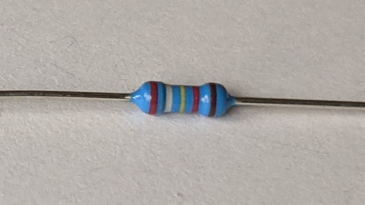
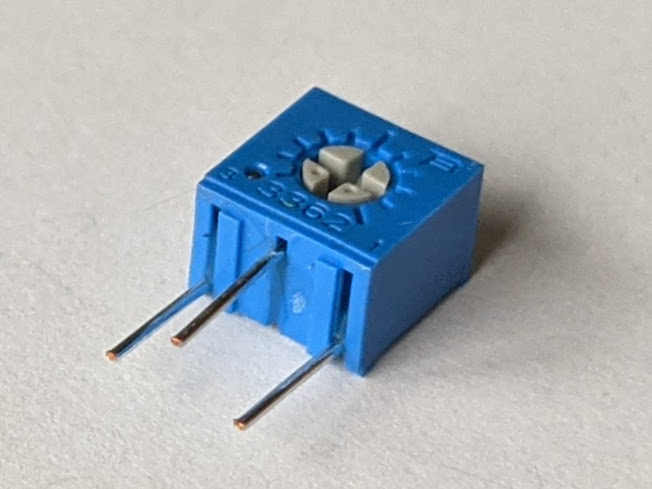

# Z80-512K - Assembly Instructions

## Prerequisites

### Tools, Equipment, and Supplies

* Soldering iron with a fine tip. Temperature controlled soldering station is recommended
* Needle nose pliers for forming components' leads
* Small side cutters for cutting components' leads
* Universal programmer capable of programming SST39F040 Flash ROM ICs. For example, MiniPro TL866CS or MiniPro TL866A
* Multimeter with frequency measurement, an oscilloscope, or a logic analyzer can be beneficial for troubleshooting
* Desk lamp, magnifying glass
* Solder suitable for soldering electronics. For example: rosin core Sn63/Pb37, Sn60/Pb40, or a lead-free solder such as Sn96.5/Ag3.0/Cu0.5 (sometimes referred to as SAC305)
* Solder wick for removing excess of solder
* 99% Isopropyl Alcohol for removing the excess of flux after soldering
* Lint free wipes, used toothbrush, cotton swabs for cleaning the PCB before and after soldering

### Parts

The table below shows the images of the components included in the kit. The up to date list of parts provided in the [Bill of Materials](README.md#bill-of-materials) section of the [README.md](README.md) file. It also provides the recommended sources for the parts.

Image                                                         | Reference | Description                                         | Quantity
------------------------------------------------------------- | --------- | --------------------------------------------------- | --------
 | PCB       | Z80-512K PCB - Version 1.2                          | 1
        | U1        | Z84C0010PEG - Z80 CPU, CMOS, 40 pin DIP             | 1
    | U2        | SST39SF040 - 512 KiB Flash ROM, 32 pin DIP          | 1
             | U3        | AS6C4008 - 512 KiB SRAM, 32 pin DIP                 | 1
           | U4        | ATF1504AS - CPLD, 64 macrocells, 44 pin PLCC        | 1
     | U5        | ADM693A - Microprocessor Supervisory Circuit        | 1
          | X1        | 7.3728 MHz, CMOS oscillator, half can               | 1
            | D1        | LED indicator, 3 mm, blue                           | 1
 | J1        | 2 pin header with friction lock                     | 1
            | J2        | 2x5 pin header, 2.54 mm pitch, vertical             | 1
 | J3        | 1x16 pin header, 2.54 mm pitch, right angle         | 2
 | J3, J4    | 2x10 pin header, 2.54 mm pitch, right angle         | 1
 | C1 - C7   | Capacitor, 0.1 uF, 50V, MLCC, 5 mm pitch            | 7
 | C7    | Capacitor, 47 uF, 25V, Electrolytic, 5 mm diameter, 2 mm pitch | 1
   | RN1       | Resistor Network, 4.7 kohm, bussed, 9 pin SIP       | 1
   | RN2       | Resistor Network, 4.7 kohm, bussed, 6 pin SIP       | 1
               | R1 - R5   | Resistor, 10 kohm, 0.25 W, 1% tolerance, axial      | 5
           | R6        | Resistor, 29.4 kohm, 0.25 W, 1% tolerance, axial    | 1
                 | R7        | Resistor, 1 kohm, 0.25 W, axial                     | 1
       | RV1       | Trimmer Resistor, 2 kohm, through hole              | 1
       | U1        | Integrated circuit socket, 40 pin DIP               | 1
       | U2, U3    | Integrated circuit socket, 32 pin DIP               | 2
     | U4        | Integrated circuit socket, 44 pin PLCC, through hole | 1
       | U5        | Integrated circuit socket, 16 pin DIP               | 1
 | X1    | 8 pin DIP, Half Can                                 | 1
                      | J1        | Jumper/Shunt, 2 pin 2.54 mm pitch                   | 1
 | J1 | 2xAAA battery enclosure with switch and connector   | 1 (Optional)

## Assembly Steps

### 1. Gather supplies and parts

* Check that you have all the equipment and parts listed in the [Prerequisites](prerequisites) section above
* Organize your workspace. If available, use ESD-safe surface and ESD strap when working on this project

### 2. Solder the components

Solder the components going from lower profile components to higher profile components, from smaller components to larger. Here is the recommended order:

* Solder RN1 and RN2 resistor arrays

* Solder C1-C7 0.1 uF capacitors. Note that these are non-polarized ceramic capacitors, so they can be oriented either way. Trim the leads using cutters

* Solder the D1 LED. Note that the LED is __polarized__. The square pad on the board correspond to the negative (cathode) lead of the LED. The negative lead on the LED is usually marked by an indent on otherwise round LED package, or by a shorter lead. If in doubt - use the multimeter (set to diode mode) to check the polarity
    

* Solder the sockets. Start with the X1 oscillator socket, continue with DIP integrated circuits' sockets, and finally solder PLCC44 socket.
  * Pay attention to the orientation of the sockets. The indents indicating pin 1, or the socket outline on the PCB's silk screen should match the socket orientation

* Form leads and solder R7, R5, and R6 resistors as shown on the picture below. If you plan to use JTAG to re-program the CPLD, also solder resistors R1-R4.
  * Resistor R7 is 1k with 5% tolerance. It is market with brown-black-red-gold color code
  * Resistor R5 is 10k with 1% tolerance. It is market with brown-black-black-red-brown color code
  * Resistor R6 is 29.4k with 1% tolerance. It is market with red-white-yellow-red-brown color code
  * Resistors R1-R4 are 10k with either 1% tolerance, marked with brown-black-black-red-brown color code, or with 5% tolerance, marked with brown-black-orange-gold color code
  * The resistors are not polarized and can be oriented either way. Trim the leads using cutters

* Solder trimmer resistor RV1. Trim the leads using cutters

* Solder J1 battery connector. Pay attention to the orientation of this connector. The connector latch should match the drawing on the PCB's silk screen. Refer to the picture below of the correct orientation

* Solder C8 capacitor. Note that this is a __polarized__ electrolytic capacitor and it needs to be oriented properly. Make sure that the negative lead of the capacitor (marked on the package) matches the white colored area on the PCB.

* Solder RC2014* headers (J3 and J4):
  * If two 1x16 and one 2x10 headers are used, cut 3 pins from one of the 1x16 headers to make a 1x13 header. Solder 2x10 header first, making sure that its pins are parallel to the board. Next solder 1x16 and 1x13 headers, making sure that they align properly with 2x10 header, and the pins form one nice straight line.
  * If 2x40 header used, using pliers gently remove extra pins - 16 pins from upper row on the left side (connector pins facing toward you), 14 pins from upper row on the right side, and one pin from the lower row on the right side. Refer to the picture below
  

  
* If you plan to use JTAG to re-program the CPLD, solder J2 2x5 header

### 3. Check your soldering work

* Make sure all pins of all components are soldered properly
* If desired, clean the flux using isopropyl alcohol, cotton swabs. You might want to scrub the board lightly with a used toothbrush to remove the flux

### 4. Insert the integrated circuits to the sockets
* Prior to inserting DIP integrated circuits to the sockets board, bend their leads slightly, so they point 90 degrees downward. Put the IC on the side and gently push it down to bend the leads. Repeat on the other side of the IC
* Double check that you're placing the integrated circuit in the right socket, check the IC orientation. The index notch on the IC should match the notch on the socket and the drawing on the PCB's silkscreen
* To insert the ATF1504AS CPLD integrated circuit in PLCC44 package, place it on the top of the socket, double check the orientation of the integrated circuit, and firmly push it down. It should click into the socket

### 5. Connect place jumper over J1 or connect a battery

* If SRAM battery backup is not needed, place a jumper on J1 connector
* If SRAM battery is desired, install two AAA batteries in the battery holder, and connect battery holder to J1 connector
* **Important**: Do not leave J1 unconnected. The board might not boot if J1 is left floating

### 6. Test the module
  * Plug the module into an RC2014* compatible backplane
  * Plug a supported serial module, such as Z80 SIO or MC68B50 ACIA. If using Steve Cousins' [SC104](https://smallcomputercentral.wordpress.com/sc104-z80-sio-2-module-rc2014/) module, make sure it is configured in "Compatibility Mode" and the address is set to 0x80
  * Double check that the modules are installed in the correct orientation, and pin 1 on the modules match that of the backplane.
  * Connect the serial console cable, such as FTDI USB to RS232 to the serial module. Launch terminal emulation software, and configure it for 115200bps, 8-bit, no parity, one stop bit operation.
  * Apply the power. The indicator LED on the Z80-512K module should blink briefly, and then light up. The RomWBW prompt should appear on the terminal.

__Congratulations! Enjoy your Z80-512K Module!__
