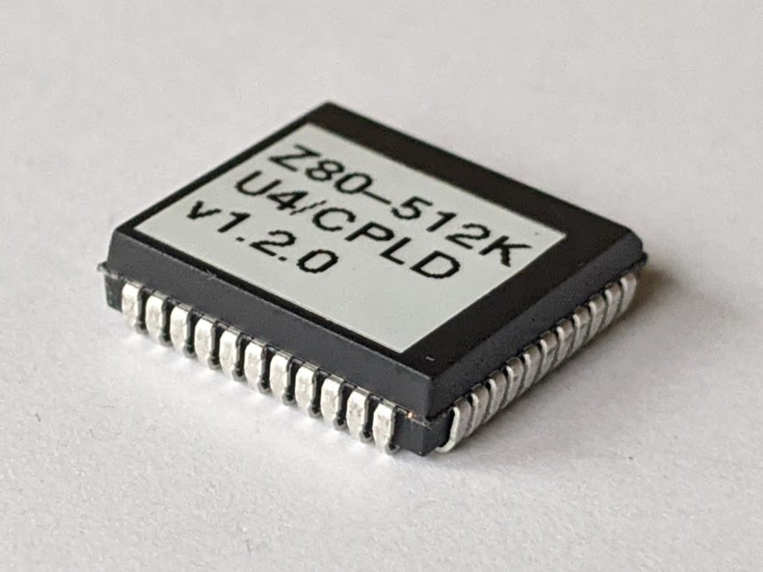
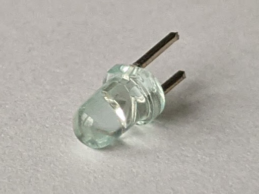
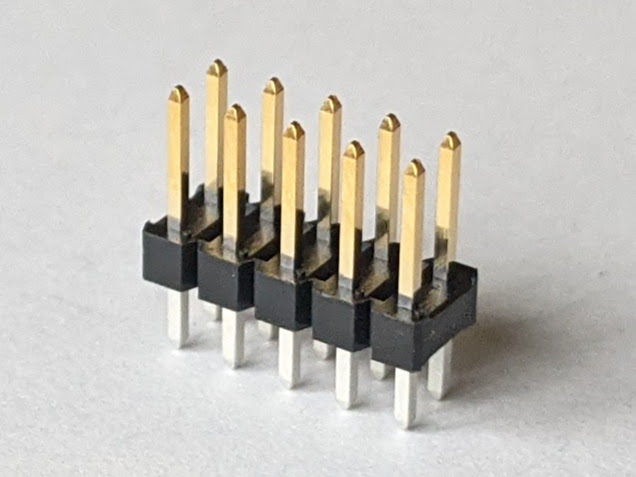
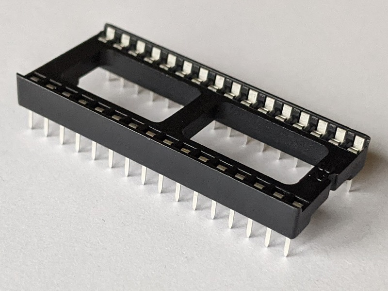
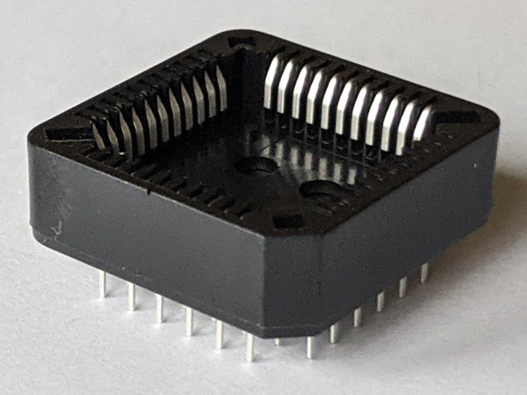
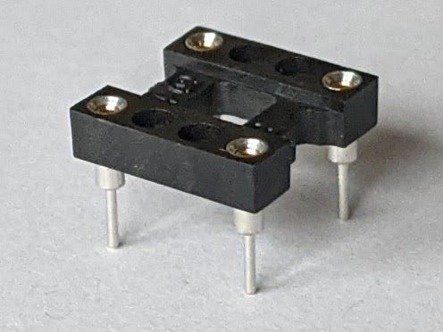
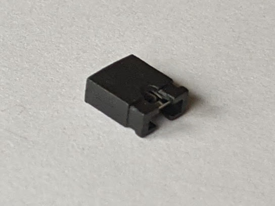
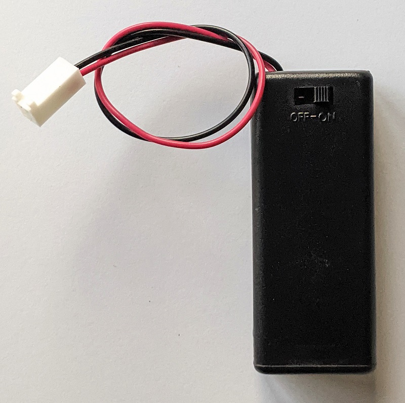

# Z80-512K - Building Instructions

## Prerequisites

### Tools, Equipment, and Supplies

* Soldering iron with a fine tip. Temperature controlled soldering station is recommended
* Needle nose pliers for forming components' leads
* Small side cutters for cutting components' leads
* Universal programmer capable of programming SST39F040 Flash ROM ICs. For example, MiniPro TL866CS or MiniPro TL866A
* Multimeter with frequency measurement, an oscilloscope, or a logic analyzer can be beneficial for troubleshooting
* Desk lamp, magnifying glass
* Solder suitable for soldering electronics. For example: rosin core Sn63/Pb37, Sn60/Pb40, or a lead-free solder such as Sn96.5/Ag3.0/Cu0.5 (sometimes referred to as SAC305)
* Solder wick for removing excess of solder
* 99% Isopropyl Alcohol for removing the excess of flux after soldering
* Lint free wipes, used toothbrush, cotton swabs for cleaning the PCB before and after soldering

### Parts

The table below shows the images of the components included in the kit. The up to date list of parts provided in the [Bill of Materials](README.md#bill-of-materials) section of the [README.md](README.md) file. It also provides the recommended sources for the parts.

Image                                                         | Reference | Description                                         | Quantity
------------------------------------------------------------- | --------- | --------------------------------------------------- | --------
 | PCB       | Z80-512K PCB - Version 1.2                          | 1
        | U1        | Z84C0010PEG - Z80 CPU, CMOS, 40 pin DIP             | 1
    | U2        | SST39SF040 - 512 KiB Flash ROM, 32 pin DIP          | 1
             | U3        | AS6C4008 - 512 KiB SRAM, 32 pin DIP                 | 1
           | U4        | ATF1504AS - CPLD, 64 macrocells, 44 pin PLCC        | 1
     | U5        | ADM693A - Microprocessor Supervisory Circuit        | 1
          | X1        | 7.3728 MHz, CMOS oscillator, half can               | 1
            | D1        | LED indicator, 3 mm, blue                           | 1
 | J1        | 2 pin header with friction lock                     | 1
            | J2        | 2x5 pin header, 2.54 mm pitch, vertical             | 1
 | J3        | 1x16 pin header, 2.54 mm pitch, right angle         | 2
 | J3, J4    | 2x10 pin header, 2.54 mm pitch, right angle         | 1
 | C1 - C7   | Capacitor, 0.1 uF, 50V, MLCC, 5 mm pitch            | 7
 | C7    | Capacitor, 47 uF, 25V, Electrolytic, 5 mm diameter, 2 mm pitch | 1
   | RN1       | Resistor Network, 4.7 kohm, bussed, 9 pin SIP       | 1
   | RN2       | Resistor Network, 4.7 kohm, bussed, 6 pin SIP       | 1
               | R1 - R5   | Resistor, 10 kohm, 0.25 W, 1% tolerance, axial      | 5
           | R6        | Resistor, 29.4 kohm, 0.25 W, 1% tolerance, axial    | 1
                 | R7        | Resistor, 1 kohm, 0.25 W, axial                     | 1
       | RV1       | Trimmer Resistor, 2 kohm, through hole              | 1
       | U1        | Intergrated circuit socket, 40 pin DIP              | 1
       | U2, U3    | Intergrated circuit socket, 32 pin DIP              | 2
     | U4        | Intergrated circuit socket, 44 pin PLCC, through hole | 1
       | U5        | Intergrated circuit socket, 16 pin DIP              | 1
 | X1    | 8 pin DIP, Half Can                                 | 1
                      | J1        | Jumper/Shunt, 2 pin 2.54 mm pitch                   | 1
 | J1 | 2xAAA battery enclosure with switch and connector   | 1 (Optional)
