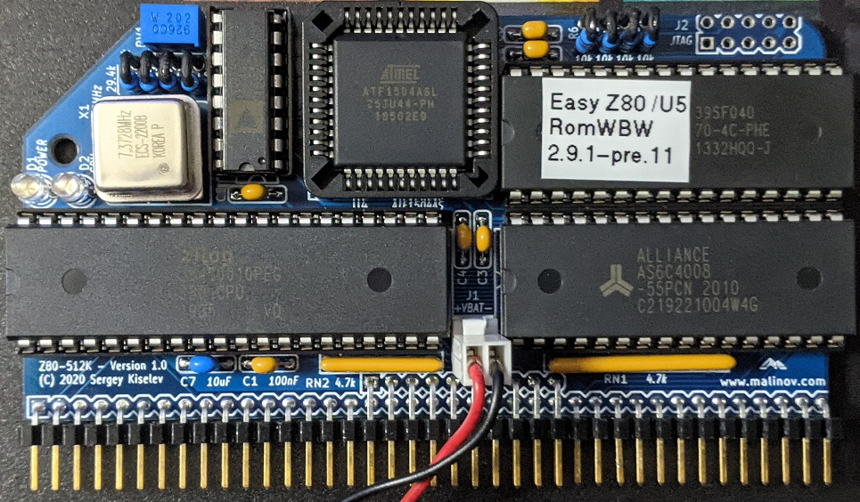

# Z80-512K
Z80 CPU and Memory Module

## Introduction
Z80-512K is an RC2014-compatible CPU and memory module, designed to run RomWBW firmware including CP/M, ZSDOS, and various applications under these OSes.

## Specifications
* Processor: Zilog Z80 CPU (CMOS version - Z84C00)
* Memory: 512 KiB battery-backed SRAM, 512 KiB Flash ROM, Zeta SBC V2 compatible memory pager
* Bus: RC2014 compatible
* Microprocessor Supervisor:
  * Reset generation
  * SRAM battery backup
  * Power failure NMI
  * Watchdog

## Hardware Documentation

### Schematic and PCB Layout

[Schematic - Version 1.0](KiCad/Z80-512K-Schematic-1.0.pdf)

[PCB Layout - Version 1.0](KiCad/Z80-512K-Board-1.0.pdf)

### Input/Output Ports
The following I/O ports are implemented in the CPLD. Note that all ports are read-only.

* 6Ch - DIVISOR - UART Clock Divisor. This register defines the ratio to divide the CPU clock (7.3728 MHz) by to produce the UART clock
  * Bit 0: Divide by 3
    * 0 = Disable divide by three
    * 1 = Enable divide by three
  * Bit 1: Divide by 2
    * O = Disable divide by two
    * 1 = Enable divide by two
  * Bit 2: Divide by 4
    * 0 = Disable divide by four
    * 1 = Enable divide by four
  * Bit 3: Divide by 16
    * 0 = Disable divide by sixteen
    * 1 = Enable divide by sixteen
  * Note: Bits 0-3 are reset to '0' on power-on or reset, so that the UART divide ratio is set to 1

* 6Dh - WDOG_ENA - Enable watchdog
  * Bit 0:
    * 0 = Disable watchdog
    * 1 = Enable watchdog
  * Note: Bit 0 is reset to '0' on power-on or reset, so that watchdog is disabled
  * Note: When watchdog is disabled, the /M1 signal is routed to WDOG signal, so that it is pulsed on every instruction fetch. When watchdog is enabled, the WDOG signal should be pulsed by writting to port 6Fh (see below) in intervals of less than 1.6 seconds.

* 6Eh - LED - User (CPU) LED Control
  * Bit 0:
    * 0 = Turn on LED
    * 1 = Turn off LED
  * Note: Bit 0 is reset to '0' on power-on or reset, so that the LED is turned on

* 6Fh - WDOG - Watchdog
  * Any write to this port pulses the WDOG signal, which resets the watchdog in the CPU supervisor U5

* 78h-7Bh - Memory page select registers
  * 78h - MPGSEL_0 - Page select register for bank #0 (0000h - 3FFFh)
  * 79h - MPGSEL_1 - Page select register for bank #1 (4000h - 7FFFh)
  * 7Ah - MPGSEL_2 - Page select register for bank #2 (8000h - 0BFFFh)
  * 7Bh - MPGSEL_3 - Page select register for bank #3 (0C000h - 0FFFFh)
  * Note: These registers implemented as 6-bit registers

* 7Ch - MPGENA - Enable memory paging
  * Bit 0:
    * 0 = Disable memory paging (default after reset). When memory paging is disabled the memory page 0 (lower 16 KiB of the Flash ROM) is mapped to all banks.
    * 1 = Enable memory paging. Make sure that memory page select registers are configured properly before enabling paging.
  * Bits 1-7 - unused
  * Note: Bit 0 is reset to '0' on power-on or reset

### Connectors

#### J1 - NVRAM Battery
Connect 3V battery for SRAM backup to this connector.

**Important: If the SRAM battery backup is not desired, short J1 with a jumper. Do not leave this connector open.**

Pin | Signal Name | Description
--- | ----------- | -----------
1  	| VBAT        | Positive terminal - +3V
2   | GND         | Negative terminal - ground

#### J2 - JTAG - CPLD
This connector can be used to program the U4 CPLD

Pin  | Signal Name | Description      | Pin  | Signal Name | Description
---- | ----------- | ---------------- | ---- | ----------- | ----------------
1    | TCK         | Test Clock       | 2    | GND         | Ground
3    | TDO         | Test Data Output | 4    | 5V          | 5V Power Supply - Output to JTAG adapter
5    | TMS         | Test Mode Select | 6    | NC          | No Connect
7    | NC          | No Connect       | 8    | NC          | No Connect
9    | TDI         | Test Data Input  | 10   | GND         | Ground

#### J3, J4 - RC2014 Bus
Pin   | Signal Name | Description         | Pin  | Signal Name | Description
----- | ----------- | --------------------------------------- | ----- | ----------- | -----------
J3-1  | A15         | Address A15; Output                     |       |             |
J3-2  | A14         | Address A14; Output                     |       |             |
J3-3  | A13         | Address A13; Output                     |       |             |
J3-4  | A12         | Address A12; Output                     |       |             |
J3-5  | A11         | Address A11; Output                     |       |             |
J3-6  | A10         | Address A10; Output                     |       |             |
J3-7  | A9          | Address A9; Output                      |       |             |
J3-8  | A8          | Address A8; Output                      |       |             |
J3-9  | A7          | Address A7; Output                      |       |             |
J3-10 | A6          | Address A6; Output                      |       |             |
J3-11 | A5          | Address A5; Output                      |       |             |
J3-12 | A4          | Address A4; Output                      |       |             |
J3-13 | A3          | Address A3; Output                      |       |             |
J3-14 | A2          | Address A2; Output                      |       |             |
J3-15 | A1          | Address A1; Output                      |       |             |
J3-16 | A0          | Address A0; Output                      |       |             |
J3-17 | GND         | Ground                                  | J4-1  | GND         | Ground
J3-18 | VCC         | Power Supply - +5V                      | J4-2  | VCC         | Power Supply - +5V
J3-19 | /M1         | Machine Cycle One; Output               | J4-3  | /RFSH | DRAM refresh; Output
J3-20 | /RESET      | Reset; Output                           | J4-4  | N/C         | Not connected
J3-21 | CPU_CLK     | CPU Clock; Output                       | J4-5  | UART_CLK    | UART Clock (programmable); Output
J3-22 | /INT        | Interrupt; Input                        | J4-6  | /BUSACK     | DMA Bus Acknowledge; Output
J3-23 | /MREQ       | Memory Request; Output                  | J4-8  | /HALT       | Halt; Output
J3-24 | /WR         | Write Request; Output                   | J4-9  | /WAIT       | Wait; Input
J3-25 | /RD         | Read Request; Output                    | J4-10 | /NMI        | Non-maskable Interrupt; Input
J3-26 | /IORQ       | Input/Output Request; Output            |       |             |
J3-27 | D0          | Data D0; Input/Output                   |       |             |
J3-28 | D1          | Data D1; Input/Output                   |       |             |
J3-29 | D2          | Data D2; Input/Output                   |       |             |
J3-30 | D3          | Data D3; Input/Output                   |       |             |
J3-31 | D4          | Data D4; Input/Output                   |       |             |
J3-32 | D5          | Data D5; Input/Output                   |       |             |
J3-33 | D6          | Data D6; Input/Output                   |       |             |
J3-34 | D7          | Data D7; Input/Output                   |       |             |
J3-35 | TXDA        | Channel A, Transmit Data; Not Connected |       |             | 
J3-36 | RXDA        | Channel A, Receive Data; Not Connected  |       |             | 
J3-37 | USR1        | User Pin 1; Not connected               |       |             |
J3-38 | USR2        | User Pin 2; Not connected               |       |             |
J3-39 | USR3        | User Pin 3; Not connected               |       |             |

### Bill of Materials

#### Version 1.0

[Z80-512K project on Mouser.com](https://www.mouser.com/ProjectManager/ProjectDetail.aspx?AccessID=53dc7b1011) - View and order all components except of the PCB.

[Z80-512K project on OSH Park](https://oshpark.com/shared_projects/XXXXXXXX) - View and order the PCB.

Component type     | Reference | Description                                 | Quantity | Possible sources and notes 
------------------ | --------- | ------------------------------------------- | -------- | --------------------------
PCB                |           | Z80-512K PCB - Version 1.0                  | 1        | Refer to the [RetroBrew Computers Board Inventory](https://www.retrobrewcomputers.org/doku.php?id=boardinventory#minimal_8085_z80_single_board_computer) page for ordering information, or order from a PCB manufacturer of your choice using provided Gerber or KiCad files
Integrated Circuit | U1        | Z84C00xxPEG - Z80 CPU, CMOS, 40 pin DIP     | 1        | Mouser [692-Z84C0010PEG](https://www.mouser.com/ProductDetail/692-Z84C0010PEG/)
Integrated Circuit | U2        | SST39SF040 - 512 KiB Flash ROM, 32 pin DIP  | 1        | Mouser [804-39SF0407CPHE](https://www.mouser.com/ProductDetail/804-39SF0407CPHE/)
Integrated Circuit | U3        | AS6C4008 - 512 KiB SRAM, 32 pin DIP         | 1        | Mouser [913-AS6C4008-55PCN](https://www.mouser.com/ProductDetail/913-AS6C4008-55PCN/)
Integrated Circuit | U4        | ATF1504AS - CPLD, 64 macrocells, 44 pin PLCC| 1        | Mouser [556-AF1504AS10JU44](https://www.mouser.com/ProductDetail/556-AF1504AS10JU44/); Possible alternative: EPM7064SLC44-10
Integrated Circuit | U5        | ADM693A - Microprocessor Supervisory Circuit| 1        | Mouser [584-ADM693ANZ](https://www.mouser.com/ProductDetail/584-ADM693ANZ/); Possible alternatives: MAX693, LTC693, ADM691, MAX691, LTC691, ADM695, MAX695, LTC965, LTC1235
Oscillator         | X1        | 7.3728 MHz, CMOS oscillator, half can       | 1        | Mouser [774-MXO45HS-3C-7.3](https://www.mouser.com/ProductDetail/774-MXO45HS-3C-7.3/)
LED                | D1        | LED indicator, 3 mm, green                  | 1        | Mouser [710-151033GS03000](https://www.mouser.com/ProductDetail/710-151033GS03000/)
LED                | D2        | LED indicator, 3 mm, blue                   | 1        | Mouser [710-151033BS03000](https://www.mouser.com/ProductDetail/710-151033BS03000/)
Connector          | J1        | 2 pin header with friction lock             | 1        | Mouser [571-6404562](https://www.mouser.com/ProductDetail/571-6404562/)
Pin Header         | J2        | 2x5 pin header, 2.54 mm pitch, vertical     | 1        | Mouser [649-77313-118-10LF](https://www.mouser.com/ProductDetail/649-77313-118-10LF/); Optional - JTAG header
Pin Header         | J3, J4    | 2x40 pin header, 2.54 mm pitch, right angle | 1        | Mouser [517-5121TG](https://www.mouser.com/ProductDetail/517-5121TG/)
Capacitor          | C1 - C6   | 0.1 uF, 50V, MLCC, 5 mm pitch               | 6        | Mouser [594-K104K15X7RF53H5](https://www.mouser.com/ProductDetail/594-K104K15X7RF53H5/)
Capacitor          | C7        | 10 uF, 25V, MLCC, 5 mm pitch                | 1        | Mouser [810-FG28X5R1E106MR06](https://www.mouser.com/ProductDetail/810-FG28X5R1E106MR06/)
Resistor Array     | RN1       | 4.7 kohm, bussed, 9 pin SIP                 | 1        | Mouser [652-4609X-AP1-472LF](https://www.mouser.com/ProductDetail/652-4609X-AP1-472LF/)
Resistor Array     | RN2       | 4.7 kohm, bussed, 6 pin SIP                 | 1        | Mouser [652-4606X-AP1-472LF](https://www.mouser.com/ProductDetail/652-4606X-AP1-472LF/)
Resistor           | R1, R2    | 1 kohm, axial                               | 2        | Mouser [603-MFR-25FRF521K](https://www.mouser.com/ProductDetail/603-MFR-25FRF521K/)
Resistor           | R3 - R7   | 10 kohm, 1% tolerance, axial                | 5        | Mouser [603-MFR-25FRF5210K](https://www.mouser.com/ProductDetail/603-MFR-25FRF5210K/)
Resistor           | R8        | 29.4 kohm, 1% tolerance, axial              | 1        | Mouser [603-MFR-25FBF52-29K4](https://www.mouser.com/ProductDetail/603-MFR-25FBF52-29K4/)
Trimmer Resistor   | RV1       | 2 kohm, through hole                        | 1        | Mouser [652-3362W-1-202LF](https://www.mouser.com/ProductDetail/652-3362W-1-202LF/)
IC Socket          | U1        | 40 pin DIP                                  | 1        | Mouser [517-4840-6000-CP](https://www.mouser.com/ProductDetail/517-4840-6000-CP/)
IC Socket          | U2, U3    | 32 pin DIP                                  | 2        | Mouser [517-4832-6000-CP](https://www.mouser.com/ProductDetail/517-4832-6000-CP/)
IC Socket          | U4        | 44 pin PLCC, through hole                   | 1        | Mouser [517-8444-11B1-RK-TP](https://www.mouser.com/ProductDetail/517-8444-11B1-RK-TP/)
IC Socket          | U5        | 16 pin DIP                                  | 1        | Mouser [517-4816-3000-CP](https://www.mouser.com/ProductDetail/517-4816-3000-CP)
Oscillator Socket  | X1        | 4 pin DIP, Half Can                         | 1        | Mouser [535-1108800](https://www.mouser.com/ProductDetail/535-1108800)

### CPLD Fuse Map

Z80-512K uses Atmel ATF1504AS or Intel/Altera EPM7064STC44 CPLD (U4) CPLD for memory pager and varous other logic. [Atmel CPLD fuse map](CPLD/output_files/Z80_512K.jed), [Altera CPLD fuse map](CPLD/output_files/Z80_512K.pof), and the CPLD source code are provided in [CPLD](CPLD) directory of this repository. Use [ATMISP](https://www.microchip.com/en-us/products/fpgas-and-plds/spld-cplds/pld-design-resources) software to program Atmel CPLD. Use free [Altera Quartus II 13.0sp1 Web Edition](https://fpgasoftware.intel.com/13.0sp1/) to program Atmel CPLD. Newer Quartus versions do not support Altera MAX7000 CPLDs.
