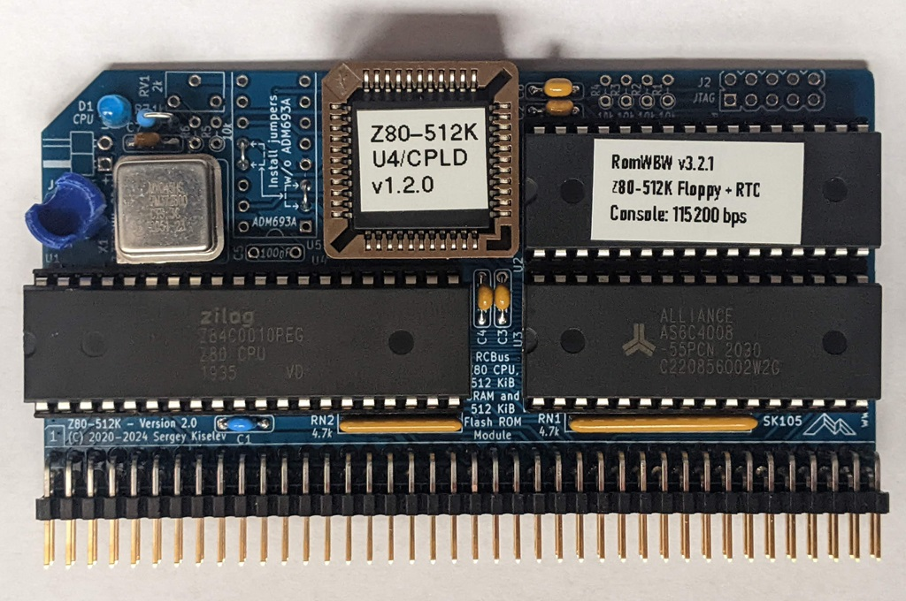

# Z80-512K
Z80 CPU, 512 KiB SRAM, and 512 KiB Flash ROM for RCBus systems

## Table of Content
* [Overview](#overview)
  * [Specifications](#specifications)
* [Assembly Instructions](#assembly-instructions)
* [Hardware Documentation](#hardware-documentation)
  * [Schematic and PCB Layout](#schematic-and-pcb-layout)
  * [Input/Output Ports](#inputoutput-ports)
  * [Connectors](#connectors)
  * [Bill of Materials](#bill-of-materials)
  * [CPLD Fuse Map](#cpld-fuse-map)
* [Release Notes](#release-notes)
  * [Changes](#changes)
  * [Known Issues](#known-issues)
* [Red Tape](#red-tape)
  * [Licensing](#licensing)
  * [Trademarks](#trademarks)

## Overview
Z80-512K is an RCBus and RC2014* compatible module, designed to run RomWBW firmware including CP/M, ZSDOS, and various applications under these OSes. Z80-512K combines functionality of the following RC2014* modules on a single module, thus saving space on the backplane:
* Z80 CPU Module
* 512k ROM 512k RAM Module
* Clock and Reset Module

In addition to these functions, Z80-512K includes programmable CLK2 clock divider, support for battery-backed SRAM, power failure NMI generation, and a watchdog.

Minimal CP/M computer system can be built using Z80-512K module, a backplane, and a serial port module, such as Z80 SIO or MC68B50 ACIA. For configurable baud rate settings, it is recommened to use serial modules that can use CLK2 as a clock, for example Steve Cousins' [SC716](https://smallcomputercentral.com/sc716-rcbus-z80-sio-2-serial-module/) or [SC725](https://smallcomputercentral.com/sc725-rcbus-serial-and-timer-module/) modules.  Additional storage module is not required, since RomWBW utilizes part of ROM and SRAM for ROM and RAM disks respecitvely, but a Compact Flash module can be added for additional storage. For a compact system, a 3-slot [SC723](https://smallcomputercentral.com/sc723-rcbus-backplane-3/) can be used.

### Specifications
* Processor: Zilog* Z80 CPU (CMOS version - Z84C00)
* Memory: 512 KiB battery-backed SRAM, 512 KiB Flash ROM, Zeta SBC V2 compatible memory pager
* Bus: RC2014* compatible
* Microprocessor Supervisor:
  * Reset generation
  * SRAM battery backup
  * Power failure NMI
  * Watchdog

## Assembly Instructions

Please refer to [Assembly Instructions](Assembly_Instructions.md) document

## Hardware Documentation

### Documentation for the Previous Versions

* [Version 1.2](https://github.com/skiselev/Z80-512K/tree/v1.2)

### Schematic and PCB Layout

* [Schematic - Version 2.0](KiCad/Z80-512K-Schematic-2.0.pdf)
* [PCB Layout - Version 2.0](KiCad/Z80-512K-Board-2.0.pdf)

### Input/Output Ports
Z80-512K uses an Atmel* ATF1504AS CPLD (complex programmable logic device) to implement Zeta SBC V2 compatible memory pager, watchdog control, and UART clock divider.
These functions are configured using registers that are accessible using I/O ports. Upon reset, the configuration registers are set to values that result in an RC2014 compatible configuration, so that RomWBW RCZ80_std.rom image can be used without any modifications.

The following I/O ports are implemented in the CPLD:

#### 0x6D - CONFIG - UART Clock Divisor and Watchdog Configuration (Read/Write)

Bits 0-4 define the ratio the 7.3728 MHz CPU clock (CLK1) is divided by to produce UART clock (CLK2).
The output clock can be calculated using the following formula: **fCLK2 (Hz) = 7372800 / (3m * 2n)**, where **m** is bit 4 of **CONFIG** register (0 or 1), and **n** are bits 3-0 of **CONFIG** register (0 to 15)

Port | Bit # | Function                | Value = 0             | Value = 1
-----|-------|-------------------------|-----------------------|----------------------
0x6D | 0     | Divide CPU clock by 2   | Disable divide by 2   | Enable divide by 2
0x6D | 1     | Divide CPU clock by 4   | Disable divide by 4   | Enable divide by 4
0x6D | 2     | Divide CPU clock by 16  | Disable divide by 16  | Enable divide by 16
0x6D | 3     | Divide CPU clock by 256 | Disable divide by 256 | Enable divide by 256
0x6D | 4     | Divide CPU clock by 3   | Disable divide by 3   | Enable divide by 3

* Note: Bits 0-4 are reset to '0' on power-on or reset, so that the divide ratio is set to 1 and the CLK2 frequency is 7.3728 MHz

Bit 5 enables or disables the watchdog and controls the generation of watchdog (WDOG) signal. On the board the WDOG signal is connected to the CPU supervisor IC U5 ADM693A. The CPU supervisor will reset the board if WDOG signal is not pulsed within 1.6 seconds.
When watchdog is disabled, the /M1 signal is routed to WDOG signal, so that it is pulsed on every instruction fetch. When watchdog is enabled, the WDOG signal should be pulsed by writting to WDOG register, port 0x6F (see below) in intervals of less than 1.6 seconds.

Port | Bit # | Function                | Value = 0             | Value = 1
-----|-------|-------------------------|-----------------------|----------------------
0x6D | 5     | Watchdog enable         | Disable watchdog      | Enable watchdog

* Note: Bit 5 is reset to '0' on power-on or reset, so that watchdog is disabled

Port | Bit # | Function                                         | Value
-----|-------|--------------------------------------------------|-----------------------
0x6D | 7-6   | Not implemented                                  | Should be set to 0

#### 0x6F - WDOG - Reset Watchdog (Write-only)

Any write to this port pulses the WDOG signal, which resets the watchdog in the CPU supervisor U5

Port | Bit # | Function                | Value
-----|-------|-------------------------|---------------------------------------------
0x6F | N/A   | WDOG - Reset watchdog   | Any write to this port resets the watchdog

#### 0x78-0x7B - MPGSEL - Memory Page Select Registers (Write-only)

Port | Bit # | Function                                         | Value
-----|-------|--------------------------------------------------|-----------------------
0x78 | 5-0   | MPGSEL_0 - Page number for bank #0 0x0000-0x3FFF | 0-31 - Page number
0x78 | 7-6   | Not implemented                                  | Should be set to 0
0x79 | 5-0   | MPGSEL_1 - Page number for bank #1 0x4000-0x7FFF | 0-31 - Page number
0x79 | 7-6   | Not implemented                                  | Should be set to 0
0x7A | 5-0   | MPGSEL_3 - Page number for bank #2 0x8000-0xBFFF | 0-31 - Page number
0x7A | 7-6   | Not implemented                                  | Should be set to 0
0x7B | 5-0   | MPGSEL_4 - Page number for bank #3 0xC000-0xFFFF | 0-31 - Page number
0x7B | 7-6   | Not implemented                                  | Should be set to 0

#### 0x7Ch - MPGENA - Enable Memory Paging (Write-only)

Port | Bit # | Function                | Value = 0             | Value = 1
-----|-------|-------------------------|-----------------------|----------------------
0x7C | 0     | Memory paging enable    | Disable memory paging | Enable memory paging

* Note: The register is reset to '0' on power-on or reset, which disables the memory paging. When memory paging is disabled the memory page 0 (lower 16 KiB of the Flash ROM) is mapped to all banks.

Port | Bit # | Function                                         | Value
-----|-------|--------------------------------------------------|-----------------------
0x7C | 7-1   | Not implemented                                  | Should be set to 0

### Connectors

#### J1 - NVRAM Battery
Connect 3V battery for SRAM backup to this connector.

**Important: If the SRAM battery backup is not desired, short J1 with a jumper. Do not leave this connector open.**

Pin | Signal Name | Description
--- | ----------- | -----------
1   | VBAT        | Positive terminal - +3V
2   | GND         | Negative terminal - ground

#### J2 - JTAG - CPLD
This connector can be used to program the U4 CPLD

Pin  | Signal Name | Description      | Pin  | Signal Name | Description
---- | ----------- | ---------------- | ---- | ----------- | ----------------
1    | TCK         | Test Clock       | 2    | GND         | Ground
3    | TDO         | Test Data Output | 4    | 5V          | 5V Power Supply - Output to JTAG adapter
5    | TMS         | Test Mode Select | 6    | NC          | No Connect
7    | NC          | No Connect       | 8    | NC          | No Connect
9    | TDI         | Test Data Input  | 10   | GND         | Ground

#### J3, J4 - RC2014* Bus
Pin   | Signal Name | Description                             | Pin   | Signal Name | Description
----- | ----------- | --------------------------------------- | ----- | ----------- | -----------
J3-1  | A15         | Address A15; Output                     | J3-41 | p41         | Reserved; Not connected
J3-2  | A14         | Address A14; Output                     | J3-42 | /BAI        | Bus Acknowledge In; Not connected
J3-3  | A13         | Address A13; Output                     | J3-43 | /BAO        | Bus Acknowledge Out; Not connected
J3-4  | A12         | Address A12; Output                     | J3-44 | p44         | Reserved; Not connected
J3-5  | A11         | Address A11; Output                     | J3-45 | p45         | Reserved; Not connected
J3-6  | A10         | Address A10; Output                     | J3-46 | p46         | Reserved; Not connected
J3-7  | A9          | Address A9; Output                      | J3-47 | p47         | Reserved; Not connected
J3-8  | A8          | Address A8; Output                      | J3-48 | p48         | Reserved; Not connected
J3-9  | A7          | Address A7; Output                      | J3-49 | A23         | Address A23; Input; Not connected
J3-10 | A6          | Address A6; Output                      | J3-50 | A22         | Address A22; Input; Not connected
J3-11 | A5          | Address A5; Output                      | J3-51 | A21         | Address A21; Input; Not connected
J3-12 | A4          | Address A4; Output                      | J3-52 | A20         | Address A20; Input; Not connected
J3-13 | A3          | Address A3; Output                      | J3-53 | A19         | Address A19; Input; Not connected
J3-14 | A2          | Address A2; Output                      | J3-54 | A18         | Address A18; Input; Not connected
J3-15 | A1          | Address A1; Output                      | J3-55 | A17         | Address A17; Input; Not connected
J3-16 | A0          | Address A0; Output                      | J3-56 | A16         | Address A16; Input; Not connected
J3-17 | GND         | Ground                                  | J3-57 | GND         | Ground
J3-18 | VCC         | Power Supply - +5V                      | J3-58 | VCC         | Power Supply - +5V
J3-19 | /M1         | Machine Cycle One; Output               | J3-59 | /RFSH       | DRAM refresh; Output
J3-20 | /RESET      | Reset; Output                           | J3-60 | PAGE         | Page ROM/RAM input; Not connected
J3-21 | CLK1        | CPU Clock; Output                       | J3-61 | CLK2        | UART Clock (programmable); Output
J3-22 | /INT        | Interrupt; Input                        | J3-62 | /BUSACK     | DMA Bus Acknowledge; Output
J3-23 | /MREQ       | Memory Request; Output                  | J3-63 | /HALT       | Halt; Output
J3-24 | /WR         | Write Request; Output                   | J3-64 | /BUSREQ     | DMA Bus Request; Input
J3-25 | /RD         | Read Request; Output                    | J3-65 | /WAIT       | Wait; Input
J3-26 | /IORQ       | Input/Output Request; Output            | J3-66 | /NMI        | Non-maskable Interrupt; Input
J3-27 | D0          | Data D0; Input/Output                   | J3-67 | D8          | Data D8; Input/Output; Not connected
J3-28 | D1          | Data D1; Input/Output                   | J3-68 | D9          | Data D9; Input/Output; Not connected
J3-29 | D2          | Data D2; Input/Output                   | J3-69 | D10         | Data D10; Input/Output; Not connected
J3-30 | D3          | Data D3; Input/Output                   | J3-70 | D11         | Data D11; Input/Output; Not connected
J3-31 | D4          | Data D4; Input/Output                   | J3-71 | D12         | Data D12; Input/Output; Not connected
J3-32 | D5          | Data D5; Input/Output                   | J3-72 | D13         | Data D13; Input/Output; Not connected
J3-33 | D6          | Data D6; Input/Output                   | J3-73 | D14         | Data D14; Input/Output; Not connected
J3-34 | D7          | Data D7; Input/Output                   | J3-74 | D15         | Data D15; Input/Output; Not connected
J3-35 | TX          | Channel 1, Transmit Data; Not Connected | J3-75 | TX2         | Channel 2, Transmit Data; Not Connected
J3-36 | RX          | Channel 1, Receive Data; Not Connected  | J3-76 | RX2         | Channel 2, Receive Data; Not Connected
J3-37 | /IRQ1       | Interrupt Request 1; Not connected      | J3-77 | /IRQ2       | Interrupt Request 2; Not connected
J3-38 | IEI         | Interrupt Enable In; Not connected      | J3-78 | p78         | Reserved; Not connected
J3-39 | IEO         | Interrupt Enable Out; Not connected     | J3-79 | p79         | Reserved; Not connected
J3-40 | USER4       | User Pin 4; Not connected               | J3-80 | USER8       | User Pin 8; Not connected

### Bill of Materials

#### Version 2.0

[Z80-512K V2 project on Mouser.com](https://www.mouser.com/ProjectManager/ProjectDetail.aspx?AccessID=a4dc766274) - View and order all components except of the PCB, CPU supervisor (optional), and JTAG header (optional).
[Z80-512K V2 - CPU Supervisor project on Mouser.com](https://www.mouser.com/ProjectManager/ProjectDetail.aspx?AccessID=bce8da5b24) - All components for CPU supervisor (optional).
[Z80-512K V2 - JTAG Header project on Mouser.com](https://www.mouser.com/ProjectManager/ProjectDetail.aspx?AccessID=c965bd23ef) - All components for JTAG header (optional).

Z80-512K project on Tindie: [Complete kit](https://www.tindie.com/products/weird/z80-512k-rc2014-compatible-module-kit/); [Z80-512K PCB, a preprogrammed CPLD and optionally a Flash ROM](https://www.tindie.com/products/weird/z80-512k-rc2014-compatible-module-pcb-and-cpld/).

Component type     | Reference | Description                                 | Quantity | Possible sources and notes 
------------------ | --------- | ------------------------------------------- | -------- | --------------------------
PCB                |           | Z80-512K PCB - Version 2.0                  | 1        | Buy from my Tindie store: [Complete kit](https://www.tindie.com/products/weird/z80-512k-rc2014-compatible-module-kit/); [Z80-512K PCB, a preprogrammed CPLD and optionally a Flash ROM](https://www.tindie.com/products/weird/z80-512k-rc2014-compatible-module-pcb-and-cpld/), or order from a PCB manufacturer of your choice using provided Gerber or KiCad files
Integrated Circuit | U1        | Z84C00xxPEG - Z80 CPU, CMOS, 40 pin DIP     | 1        | Mouser [692-Z84C0010PEG](https://www.mouser.com/ProductDetail/692-Z84C0010PEG)
Integrated Circuit | U2        | SST39SF040 - 512 KiB Flash ROM, 32 pin DIP  | 1        | Mouser [804-39SF0407CPHE](https://www.mouser.com/ProductDetail/804-39SF0407CPHE)
Integrated Circuit | U3        | AS6C4008 - 512 KiB SRAM, 32 pin DIP         | 1        | Mouser [913-AS6C4008-55PCN](https://www.mouser.com/ProductDetail/913-AS6C4008-55PCN)
Integrated Circuit | U4        | ATF1504AS - CPLD, 64 macrocells, 44 pin PLCC| 1        | Mouser [556-AF1504AS10JU44](https://www.mouser.com/ProductDetail/556-AF1504AS10JU44); Possible alternative: Altera EPM7064SLC44-10
Integrated Circuit | U5        | ADM693A - Microprocessor Supervisory Circuit| 1        | Mouser [584-ADM693ANZ](https://www.mouser.com/ProductDetail/584-ADM693ANZ). Optional: CPU reset, watchdog, and power failure NMI. Possible alternatives: MAX693, LTC693, ADM691, MAX691, LTC691, ADM695, MAX695, LTC965, LTC1235
Oscillator         | X1        | 7.3728 MHz, CMOS oscillator, half can       | 1        | Mouser [774-MXO45HS-3C-7.3](https://www.mouser.com/ProductDetail/774-MXO45HS-3C-7.3) or [520-2200B-073](https://www.mouser.com/ProductDetail/520-2200B-073/)
LED                | D1        | LED indicator, 3 mm, blue                   | 1        | Mouser [710-151033BS03000](https://www.mouser.com/ProductDetail/710-151033BS03000)
Connector          | J1        | 2 pin header with friction lock, right angle| 1        | Mouser [571-6404572](https://www.mouser.com/ProductDetail/571-6404572). Optional: battery-backed SRAM
Pin Header         | J2        | 2x5 pin header, 2.54 mm pitch, vertical     | 1        | Mouser [649-77313-118-10LF](https://www.mouser.com/ProductDetail/649-77313-118-10LF). Optional: JTAG header
Pin Header         | J3        | 2x40 pin header, 2.54 mm pitch, right angle | 1        | Mouser [517-5121TG](https://www.mouser.com/ProductDetail/517-5121TG)
Capacitor          | C1        | 10 uF, 25V, MLCC, 5 mm pitch                | 1 | Mouser [810-FG28X5R1E106MR06](https://www.mouser.com/ProductDetail/810-FG28X5R1E106MR06)
Capacitor          | C2 - C7   | 0.1 uF, 50V, MLCC, 5 mm pitch               | 6        | Mouser [594-K104K15X7RF53H5](https://www.mouser.com/ProductDetail/594-K104K15X7RF53H5). Note: C5 is optional, required if U5 installed
Resistor Array     | RN1       | 4.7 kohm, bussed, 9 pin SIP                 | 1        | Mouser [652-4609X-1LF-4.7K](https://www.mouser.com/ProductDetail/652-4609X-1LF-4.7K) or [652-4609X-AP1-472LF](https://www.mouser.com/ProductDetail/652-4609X-AP1-472LF)
Resistor Array     | RN2       | 4.7 kohm, bussed, 6 pin SIP                 | 1        | Mouser [652-4606X-1LF-4.7K](https://www.mouser.com/ProductDetail/652-4606X-1LF-4.7K) or [652-4606X-AP1-472LF](https://www.mouser.com/ProductDetail/652-4606X-AP1-472LF)
Resistor           | R1 - R5   | 10 kohm, 0.25 W, 1% tolerance, axial        | 5        | Mouser [603-MFR-25FRF5210K](https://www.mouser.com/ProductDetail/603-MFR-25FRF5210K). Optional: R1 - R4 - JTAG header, R5 - Power failure NMI	
Resistor           | R6        | 29.4 kohm, 0.25 W, 1% tolerance, axial      | 1        | Mouser [603-MFR-25FBF52-29K4](https://www.mouser.com/ProductDetail/603-MFR-25FBF52-29K4). Optional: Power failure NMI
Resistor           | R7        | 1 kohm, 0.25 W, axial                       | 1        | Mouser [603-MFR-25FRF521K](https://www.mouser.com/ProductDetail/603-MFR-25FRF521K)
Trimmer Resistor   | RV1       | 2 kohm, through hole                        | 1        | Mouser [652-3362W-1-202LF](https://www.mouser.com/ProductDetail/652-3362W-1-202LF). Optional: Power failure NMI
IC Socket          | U1        | 40 pin DIP                                  | 1        | Mouser [517-4840-6000-CP](https://www.mouser.com/ProductDetail/517-4840-6000-CP)
IC Socket          | U2, U3    | 32 pin DIP                                  | 2        | Mouser [517-4832-6000-CP](https://www.mouser.com/ProductDetail/517-4832-6000-CP)
IC Socket          | U4        | 44 pin PLCC, through hole                   | 1        | Mouser [517-8444-11B1-RK-TP](https://www.mouser.com/ProductDetail/517-8444-11B1-RK-TP)
IC Socket          | U5        | 16 pin DIP                                  | 1        | Mouser [517-4816-3000-CP](https://www.mouser.com/ProductDetail/517-4816-3000-CP). Optional: CPU reset, watchdog, and power failure NMI. Install two wire jumpers as indicated on the PCB if U5 is not used.
Oscillator Socket  | X1        | 4 pin DIP, Half Can                         | 1        | Mouser [535-1108800](https://www.mouser.com/ProductDetail/535-1108800)
Jumper             | J1        | Shunt, 2 pin 2.54 mm pitch                  | 1        | Mouser [806-SX1100-B](https://www.mouser.com/ProductDetail/806-SX1100-B). Optional: install if battery is not used, but U5 is installed
Connector Contacts | J1        | Connector contact                           | 2        | Mouser [571-14453361](https://www.mouser.com/ProductDetail/571-14453361). Optional: connector for battery enclosure, install for battery-backed SRAM
Connector Housing  | J1        | 2 pin housing, 2.54 mm pitch                | 1        | Mouser [571-13758202](https://www.mouser.com/ProductDetail/571-13758202). Optional: connector for battery enclosure, install for battery-backed SRAM
Battery holder     | J1        | 2xAAA battery enclosure with switch         | 1        | Mouser [12BH421/CS-GR](https://www.mouser.com/ProductDetail/12BH421-CS-GR). Optional: battery enclosure, install for battery-backed SRAM

### CPLD Fuse Map

Z80-512K uses Atmel ATF1504AS or Intel*/Altera* EPM7064STC44 CPLD (U4) CPLD for memory pager and varous other logic. [Atmel CPLD fuse map](CPLD/output_files/Z80_512K.jed), [Altera CPLD fuse map](CPLD/output_files/Z80_512K.pof), and the CPLD source code are provided in [CPLD](CPLD) directory of this repository. Use [ATMISP](https://www.microchip.com/en-us/products/fpgas-and-plds/spld-cplds/pld-design-resources) software to program Atmel CPLD. Use free [Altera Quartus II 13.0sp1 Web Edition](https://fpgasoftware.intel.com/13.0sp1/) to program Altera CPLD. Newer Quartus versions do not support Altera MAX7000 CPLDs.

## Release Notes

### Changes

* Version 2.0:
  * Update form factor from RC2014* compatible to RCBus
  * Move the battery connector to the edge of the board
  * Make U5, CPU Supervisor IC, optional. Add information on the silkscreen for the configuration without U5

* Version 1.2
  * Add CPU LED back. Use WDOG signal to control the LED

* Version 1.1
  * Add CPLD STATUS register read back capability
  * Remove LEDs
  * Improve PCB routing: use wider traces where possible, better ground fill
  * Add signal names on the bottom silk screen

* Version 1.0
  * Initial version

### Known Issues

* Version 1.1
  * No diagnostic LEDs
    * Workaround: Connect an external LED in series with 1 kohm resistor between U5 pin 11 (WDOG signal) and VCC signal.

* Version 1.0
  * No CPLD STATUS register read back
    * Workaround: Program CPLD with the version 1.1 fuse map. Cut LED_OUT trace at D2 LED (negative terminal), connect U4 pin 36 to U1 pin 21 (RD signal) with a piece of wire. If diagnostic LED is needed, connect negative terminal of the LED to U5 pin 11 (WDOG signal)

### Wishlist
* Consider using JST connector for the battery
  * Lower profile than TE latchable connector
  * Ready-made battery holders with JST connectors, such as [Adafruit 4191](https://www.adafruit.com/product/4191) can be used

## Red Tape

### Licensing

Z80-512K is an open source hardware project certified by [Open Source Hardware Association](https://www.oshwa.org/), certification UID is [US001061](https://certification.oshwa.org/us001061.html). The hardware design itself, including schematic and PCB layout design files are licensed under the strongly-reciprocal variant of [CERN Open Hardware Licence version 2](license-cern_ohl_s_v2.txt). The CPLD VHDL code is licensed under [GNU General Public License v3](license-gpl-3.0.txt). Documentation, including this file, is licensed under the [Creative Commons Attribution-ShareAlike 4.0 International License](license-cc-by-sa-4.0.txt).

### Trademarks

* "RC2014" is a registered trademark of RFC2795 Ltd.
* Other names and brands may be claimed as the property of others.
